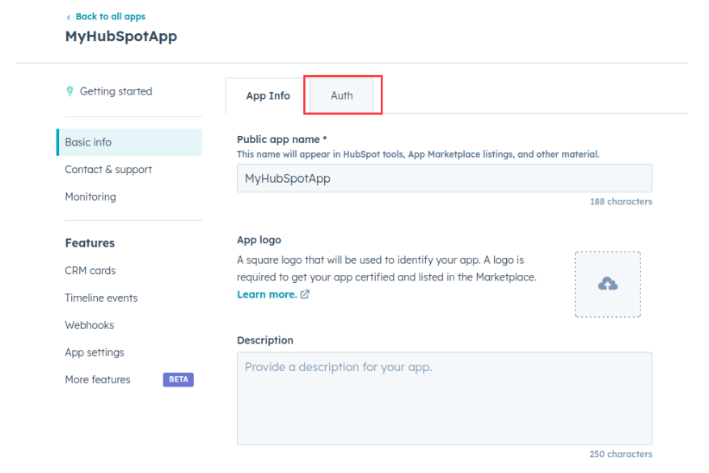
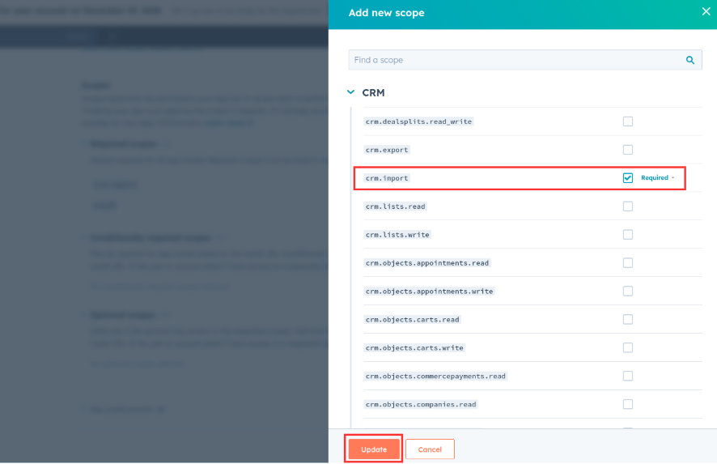
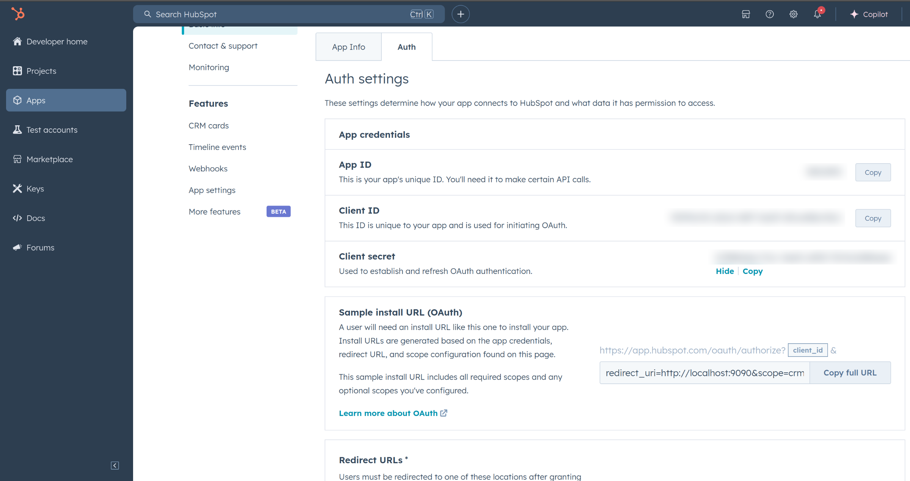

## Overview

[HubSpot](https://www.hubspot.com/our-story) is an AI-powered customer relationship management (CRM) platform. 

The ballerinax `ballerinax/hubspot.crm.imports` offers APIs to connect and interact with the [HubSpot CRM Imports API](https://developers.hubspot.com/docs/api/crm/imports) endpoints, specifically based on the [HubSpot CRM Imports API v3 OpenAPI spec](https://github.com/HubSpot/HubSpot-public-api-spec-collection/blob/main/PublicApiSpecs/CRM/Imports/Rollouts/144903/v3/imports.json)

## Setup guide

To use the HubSpot CRM imports connector, you must have access to the HubSpot API through a HubSpot developer account and a HubSpot App under it. Therefore you need to register for a developer account at HubSpot if you don't have one already.

### Step 1: Create/Login to a HubSpot Developer Account

If you have an account already, go to the [HubSpot developer portal](https://app.hubspot.com/)

If you don't have a HubSpot Developer Account you can sign up to a free account [here](https://developers.hubspot.com/get-started)

### Step 2 (Optional): Create a [Developer Test Account](https://developers.hubspot.com/beta-docs/getting-started/account-types#developer-test-accounts) under your account

Within app developer accounts, you can create developer test accounts to test apps and integrations without affecting any real HubSpot data.

> **Note:**_These accounts are only for development and testing purposes. In production you should not use Developer Test Accounts._**

1. Go to Test Account section from the left sidebar.

   

2. Click Create developer test account.

   

3. In the dialogue box, give a name to your test account and click create.

   

### Step 3: Create a HubSpot App under your account.

1. In your developer account, navigate to the "Apps" section. Click on "Create App"

   

2. Provide the necessary details, including the app name and description.

### Step 4: Configure the Authentication Flow.

1. Move to the Auth Tab.

   

2. In the Scopes section, add the following scopes for your app using the "Add new scope" button.

   `crm.objects.import`

   

4. Add your Redirect URI in the relevant section. You can also use localhost addresses for local development purposes. Click Create App.

   

### Step 5: Get your Client ID and Client Secret

- Navigate to the Auth section of your app. Make sure to save the provided Client ID and Client Secret.

   

### Step 6: Setup Authentication Flow

Before proceeding with the Quickstart, ensure you have obtained the Access Token using the following steps:

1. Create an authorization URL using the following format:

   ```
   https://app.hubspot.com/oauth/authorize?client_id=<YOUR_CLIENT_ID>&scope=<YOUR_SCOPES>&redirect_uri=<YOUR_REDIRECT_URI>
   ```

   Replace the `<YOUR_CLIENT_ID>`, `<YOUR_REDIRECT_URI>` and `<YOUR_SCOPES>` with your specific value.

    **_NOTE: If you are using a localhost redirect url, make sure to have a listener running at the relevant port before executing the next step. You can use [this gist](https://gist.github.com/lnash94/0af47bfcb7cc1e3d59e06364b3c86b59) and run it using `bal run`. Alternatively, you can use any other method to bind a listener to the port._**

2. Paste it in the browser and select your developer test account to install the app when prompted.

   

3. A code will be displayed in the browser. Copy the code.

   ```
   Received code: na1-xxxx-xxxx-xxxx-xxxx-xxxxxxxxxxxx
   ```

4. Run the following curl command. Replace the `<YOUR_CLIENT_ID>`, `<YOUR_REDIRECT_URI`> and `<YOUR_CLIENT_SECRET>` with your specific value. Use the code you received in the above step 3 as the `<CODE>`.

   - Linux/macOS

     ```bash
     curl --request POST \
     --url https://api.hubapi.com/oauth/v1/token \
     --header 'content-type: application/x-www-form-urlencoded' \
     --data 'grant_type=authorization_code&code=<CODE>&redirect_uri=<YOUR_REDIRECT_URI>&client_id=<YOUR_CLIENT_ID>&client_secret=<YOUR_CLIENT_SECRET>'
     ```

   - Windows

     ```bash
     curl --request POST ^
     --url https://api.hubapi.com/oauth/v1/token ^
     --header 'content-type: application/x-www-form-urlencoded' ^
     --data 'grant_type=authorization_code&code=<CODE>&redirect_uri=<YOUR_REDIRECT_URI>&client_id=<YOUR_CLIENT_ID>&client_secret=<YOUR_CLIENT_SECRET>'
     ```

   This command will return the access token necessary for API calls.

   ```json
   {
     "token_type": "bearer",
     "refresh_token": "<Refresh Token>",
     "access_token": "<Access Token>",
     "expires_in": 1800
   }
   ```

5. Store the access token securely for use in your application.

## Quickstart

To use the `HubSpot CRM Imports` connector in your Ballerina application, update the `.bal` file as follows:

### Step 1: Import the module

Import the `hubspot.crm.import` module and `oauth2` module.

```ballerina
import ballerinax/hubspot.crm.'import as crmImport;
import ballerina/oauth2;
```

### Step 2: Instantiate a new connector

1. Create a `Config.toml` file and, configure the obtained credentials in the above steps as follows:

   ```toml
    clientId = "<Client Id>"
    clientSecret = "<Client Secret>"
    refreshToken = "<Refresh Token>"
   ```

2. Instantiate a `crmImport:ConnectionConfig` with the obtained credentials and initialize the connector with it.

    ```ballerina 
    configurable string clientId = ?;
    configurable string clientSecret = ?;
    configurable string refreshToken = ?;

    final hscimport:ConnectionConfig hscimportConfig = {
        auth : {
            clientId,
            clientSecret,
            refreshToken,
            credentialBearer: oauth2:POST_BODY_BEARER
        }
    };

    final crmImport:Client baseClient = check new crmImport:Client(config);
    ```

### Step 3: Invoke the connector operation

Now, utilize the available connector operations. A sample usecase is shown below.

#### Get a paged list of active imports
    
```ballerina
public function main() returns error? {
    crmImport:CollectionResponsePublicImportResponse response = check baseClient->/crm/v3/imports.get({});
}
```


## Examples

The `HubSpot CRM Imports` connector provides practical examples illustrating usage in various scenarios. Explore these [examples](https://github.com/ballerina-platform/module-ballerinax-hubspot.crm.import/tree/main/examples), covering the following use cases: